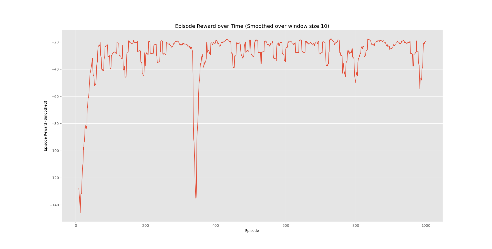

<h1><center>RL-exp1</center></h1>

<center>BY  唐志鹏  SA23011068</center>

## 实验内容

- 理解学习蒙特卡洛算法原理
- 理解学习TD算法原理

## 实验原理

- **mc**
  - 根据每个 episode 的结果和 bellman equation 更新 $Q(s,a)$ 的值
  - 根据每次新的 $Q(s,a)$ 的值来更新策略
  - 重复上述过程直至策略逼近最优策略
- **td**
  - 算法步骤与 **mc** 相同
  - **sarsa**: 使用 $\text{TD target} = R_{t+1}+\gamma Q(S_{t+1}, A_{t+1})$ 来估计 $G_t$
  - **q-learning**: 使用 $\text{TD target} = R_{t+1}+\gamma \text{max}_{a'}Q(S_{t+1},a')$ 来估计 $G_t$

## mc

### implmentation

```python
# step 1 : Generate an episode.
	# An episode is an array of (state, action, reward) tuples
# Firstly, reset env. 'episode[state_action]' is a list of (state, action) 
# in the episode, and 'episode[reward]' is a list of reward in the episode. 
# Secondly, Choose A from S using the policy ε-greedy in Q, until S is 
# terminal.
observation = env.reset()
episode = {'state_action' : [], 'reward' : []}
for _ in range(100):
    A = policy(observation)
    action = 0 if np.random.rand() <= A[0] else 1
    episode['state_action'].append((observation, action))
    observation, reward, done, _ = env.step(action)
    episode['reward'].append(reward)
    if done:
        break

# step 2 : Find all (state, action) pairs we've visited in this episode
# 'mode' decide to use first_visit or every_visit.
# Record sum of G and count of occurences for each (state, action) pair.
G = 0
for i in range(1, len(episode['reward'])+1):
    G = discount_factor * G + episode['reward'][-i]
    if mode == 'first_visit':
        if episode['state_action'][-i] not in episode['state_action'][:-i]:
            returns_sum[episode['state_action'][-i]] += G
            returns_count[episode['state_action'][-i]] += 1
    elif mode == 'every_visit':
        returns_sum[episode['state_action'][-i]] += G
        returns_count[episode['state_action'][-i]] += 1

# step 3 : Calculate average return for this state over all sampled episodes
# Q[state][action] = (sum of G) / (count of occurences).
# Update Q.
for state_action in returns_sum.keys():
    state, action = state_action
    Q[state][action] = returns_sum[state_action] / returns_count[state_action]
policy = make_epsilon_greedy_policy(Q, epsilon, env.action_space.n)
```

### result

- **first-visit: 10000 episodes**

  <center class="half">
  
  
  </center>
  
- **first-visit: 500000 episodes**

  <center class="half">
  
  
  </center>

- **every-visit: 10000 episodes**

  <center class="half">
  
  
  </center>
  
- **every-visit: 500000 episodes**

  <center class="half">
  
  
  </center>

- `first-visit` 与 `every-visit` 在 500000 个 episodes 的情况下的结果更加接近，因为两个算法最终都收敛于同一解

## sarsa

### implmentation

```python
# step 1 : Take a step
# Function 'choose_action' choose an action using the policy ε-greedy in Q.
action = choose_action(policy(state))
new_state, reward, done, _ = env.step(action)

# Update statistics
stats.episode_rewards[i_episode] += reward
stats.episode_lengths[i_episode] = t

# step 2 : TD Update
# Update Q
Q[state][action] += alpha * (reward + discount_factor * max(Q[new_state]) - Q[state][action])
policy = make_epsilon_greedy_policy(Q, epsilon, env.action_space.n)
state = new_state
if done:
    break
```

### result
- **Episode Length over Time: 500 episodes**
  
  
- **Episode Reward over Time: 500 episodes**

  
- **Episode per time step: 500 episodes**

  
- **Episode Length over Time: 1000 episodes**
  
  
- **Episode Reward over Time: 1000 episodes**

  
- **Episode per time step: 1000 episodes**

  

## q-learning
### implmentation
```python
# step 1 : Take a step
action = choose_action(policy(state))
new_state, reward, done, _ = env.step(action)

# Update statistics
stats.episode_rewards[i_episode] += reward
stats.episode_lengths[i_episode] = t

# step 2 : TD Update
Q[state][action] += alpha * (reward + discount_factor * max(Q[new_state]) - Q[state][action])
policy = make_epsilon_greedy_policy(Q, epsilon, env.action_space.n)
state = new_state
if done:
    break
```

### result
- **Episode Length over Time: 500 episodes**
  
  
- **Episode Reward over Time: 500 episodes**

  
- **Episode per time step: 500 episodes**

  
- **Episode Length over Time: 1000 episodes**
  
  
- **Episode Reward over Time: 1000 episodes**

  
- **Episode per time step: 1000 episodes**

  

## double-q-learning
### implmentation
```python
def make_epsilon_greedy_policy(Q1, Q2, epsilon, nA):
    """
    Creates an epsilon-greedy policy based on a given Q-function and epsilon.
    
    Args:
        Q: A dictionary that maps from state -> action-values.
            Each value is a numpy array of length nA (see below)
        epsilon: The probability to select a random action . float between 0 and 1.
        nA: Number of actions in the environment.
    
    Returns:
        A function that takes the observation as an argument and returns
        the probabilities for each action in the form of a numpy array of length nA.
    
    """
    def policy_fn(observation):
        A = np.ones(nA, dtype=float) * epsilon / nA
        best_action = np.argmax(Q1[observation]+Q2[observation])
        A[best_action] += (1.0 - epsilon)
        return A
    return policy_fn

def choose_action(A):
    prob = np.random.rand()
    distribute = np.zeros(len(A)+1)
    for i in range(1, len(distribute)):
        distribute[i] = distribute[i-1]+A[i-1]
    distribute[len(A)] = 1
    for i in range(len(distribute)-1):
        if distribute[i] <= prob < distribute[i+1]:
            return i

def double_q_learning(env, num_episodes, discount_factor=1.0, alpha=0.5, epsilon=0.1):
    """
    Q-Learning algorithm: Off-policy TD control. Finds the optimal greedy policy
    while following an epsilon-greedy policy
    
    Args:
        env: OpenAI environment.
        num_episodes: Number of episodes to run for.
        discount_factor: Gamma discount factor.
        alpha: TD learning rate.
        epsilon: Chance the sample a random action. Float betwen 0 and 1.
    
    Returns:
        A tuple (Q, episode_lengths).
        Q is the optimal action-value function, a dictionary mapping state -> action values.
        stats is an EpisodeStats object with two numpy arrays for episode_lengths and episode_rewards.
    """
    
    # The final action-value function.
    # A nested dictionary that maps state -> (action -> action-value).
    Q1 = defaultdict(lambda: np.zeros(env.action_space.n))
    Q2 = defaultdict(lambda: np.zeros(env.action_space.n))

    # Keeps track of useful statistics
    stats = plotting.EpisodeStats(
        episode_lengths=np.zeros(num_episodes),
        episode_rewards=np.zeros(num_episodes))    
    
    # The policy we're following
    policy = make_epsilon_greedy_policy(Q1, Q2, epsilon, env.action_space.n)
    
    for i_episode in range(num_episodes):
        # Print out which episode we're on, useful for debugging.
        if (i_episode + 1) % 100 == 0:
            print("\rEpisode {}/{}.".format(i_episode + 1, num_episodes), end="")
            sys.stdout.flush()
        
        # Reset the environment and pick the first action
        state = env.reset()

        # One step in the environment
        # total_reward = 0.0
        for t in itertools.count():
 ########################################Implement your code here##########################################################################       

            
            # step 1 : Take a step
            action = choose_action(policy(state))
            new_state, reward, done, _ = env.step(action)

            # Update statistics
            stats.episode_rewards[i_episode] += reward
            stats.episode_lengths[i_episode] = t
            
            # step 2 : TD Update
            if np.random.rand() < 0.5:
                Q1[state][action] += alpha * (reward + discount_factor * Q2[new_state][np.argmax(Q1[new_state])] - Q1[state][action])
            else:
                Q2[state][action] += alpha * (reward + discount_factor * Q1[new_state][np.argmax(Q2[new_state])] - Q2[state][action])
            policy = make_epsilon_greedy_policy(Q1, Q2, epsilon, env.action_space.n)
            state = new_state
            if done:
                break

#######################################Imlement your code end###########################################################################
    return Q1, Q2, stats
```
### result
- **Episode Length over Time: 500 episodes**
  
  
- **Episode Reward over Time: 500 episodes**

  
- **Episode per time step: 500 episodes**

  
- **Episode Length over Time: 1000 episodes**
  
  
- **Episode Reward over Time: 1000 episodes**

  
- **Episode per time step: 1000 episodes**

  

## conclusion

- 收敛速度：`q-learning` > `sarsa` > `double-q-learning`
- reward 稳定性：`double-q-learning` > `sarsa` > `q-learning`
- `q-learning` 直接学习的是最优策略，而 `sarsa` 在学习最优策略的同时还在做探索。
- `q-learning` 直接学习最优策略，但是最优策略会依赖于训练中产生的一系列数据，所以受样本数据的影响较大，因此受到训练数据方差的影响很大。
- 在学习过程中，`sarsa` 在收敛的过程中鼓励探索，这样学习过程会比较平滑，不至于过于激进，导致出现像 `q-learning` 可能遇到一些特殊的最优“陷阱”。