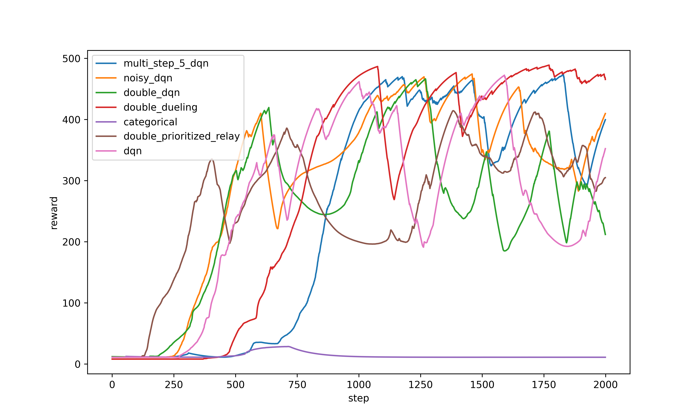

<h1><center>RL-exp2</center></h1>
<center>BY  唐志鹏  SA23011068</center>

## 1 实验内容
- 实现 DQN, Double DQN, Dueling DQN, Dueling Double DQN 算法
- 在两个仿真环境下进行训练，并比较不同算法的性能
- 本文还实现了 multi-step learning, noisy-net, prioritized relay, categorical dqn

## 2 原理与实现
源码参见 [DQN](https://github.com/Zhipeng-Tang/ReinforceLearningExp/blob/master/RL-exp2/src/DQN.py)
### 2.1 DQN
#### 2.1.1 算法原理
- step1: 在环境中采取行动 $a_i$，然后将 $(s_i, a_i, s_{i+1}, r_i)$ 插入 Experience Relay
- step2: 如果 Experience Relay 中有足够的数据，则随机采样 $(s_i, a_i, s_{i+1}, r_i)$ 进行训练
- step3: ${\rm target}(s_i) = r_i + \gamma {\rm max}_{a'}Q_{\phi^-}(s_{i+1}, a')$
- step4: $\phi \leftarrow \phi + \alpha ({\rm target(s_i) - Q_{\phi}(s_i,a_i)}) \frac{{\rm d} Q_{\phi}}{{\rm d} \phi}$
- step5: 每训练 N 步, 令 $\phi^- = \phi$
- 重复上述步骤

#### 2.1.2 实现
- 首先是 Expericence Relay 的实现
  ```python
  class Memory:
    def __init__(self, capacity):
        '''
        capacity: max capacity of memory
        '''
        self.buffer = collections.deque(maxlen=capacity)
        self.capacity = capacity

    def set(self, data, index):
        # 如果 memory 还未满，直接将 data 放入 memory 中
        # 否则，将 data 放入 index 处，替换最旧的数据
        if len(self.buffer) < self.capacity:
            self.buffer.append(data)
        else:
            self.buffer[index] = data
    
    def get(self, batch_size):
        # 随机采样
        batch = random.sample(self.buffer, batch_size)
        return batch
  ```
- 然后是 DQN 的实现
  ```python
  def learn(self):
    # update the parameters
    if self.learn_step_counter % self.q_network_iteration ==0:
        self.target_net.load_state_dict(self.eval_net.state_dict())
    if self.learn_step_counter % self.saving_iteration == 0:
        self.save_train_model(self.learn_step_counter)

    self.learn_step_counter += 1

    # 随机采样数据
    batch = self.get_batch(self.batch_size)

    # 将数据转换为 torch.tensor
    curr_states = torch.tensor(np.array([data.state for data in batch]), dtype=torch.float).to(device)
    curr_actions = torch.tensor(np.array([data.action for data in batch]), dtype=torch.int64).to(device)
    rewards = torch.tensor(np.array([data.reward for data in batch]), dtype=torch.float).to(device)
    next_states = torch.tensor(np.array([data.next_state for data in batch]), dtype=torch.float).to(device)
    dones = torch.tensor(np.array([data.done for data in batch]), dtype=torch.float).to(device)

    curr_action_values: torch.Tensor = self.calc_eval_action_values(curr_states)
    next_action_values: torch.Tensor = self.calc_target_action_values(next_states)

    # 计算网络估计的 reward 的期望
    choices = curr_action_values.gather(1, curr_actions.view(self.batch_size,1)).view(self.batch_size)
    
    # 计算真值
    targets = rewards + torch.max(next_action_values,dim=1).values * (self.gamma ** self.multi_step) * (1 - dones)

    # 计算 loss
    loss = self.loss_func(choices, targets)
    
    # 梯度下降
    self.optimizer.zero_grad()
    loss.backward()
    self.optimizer.step()
  ```

### 2.2 Double DQN
#### 2.2.1 原理
- DQN target: 
  $$
  {\rm target}(s_t) = r_t + \gamma Q_{\phi ^ -}(s_{t+1}, \argmax_{a'}Q_{\phi ^ -}(s_{t+1}, a'))
  $$
- Double DQN target: 
  $$
  {\rm target}(s_t) = r_t + \gamma Q_{\phi ^ -}(s_{t+1}, \argmax_{a'}Q_{\phi}(s_{t+1}, a'))
  $$

#### 2.2.2 实现
```python
# 下面是 DQN 的成员函数 learn 的一部分
# Double DQN 集成在类 DQN 中，只是在函数 learn 中修改了计算 target 的方法
curr_action_values: torch.Tensor = self.calc_eval_action_values(curr_states)
next_action_values: torch.Tensor = self.calc_target_action_values(next_states)

choices = curr_action_values.gather(1, curr_actions.view(self.batch_size,1)).view(self.batch_size)

# DQN
if not self.is_double:
    targets = rewards + torch.max(next_action_values,dim=1).values * (self.gamma ** self.multi_step) * (1 - dones)
# Double DQN
else:
    next_action_values_using_evalnet = self.calc_eval_action_values(next_states)
    targets = rewards + next_action_values.gather(1, torch.argmax(next_action_values_using_evalnet,dim=1).view(self.batch_size, 1)).view(self.batch_size) * (self.gamma ** self.multi_step) * (1 - dones)
```

### 2.3 Dueling DQN and Dueling DDQN
#### 2.3.1 原理
- 与 DQN 的网络直接输出 $Q$ 不同，Dueling DQN 的网络的 $Q$ 由如下公式确定：
  $$
  Q(s,a) = V(s) + A(s,a) - \frac{1}{\mathbb{A}} \sum_{a \in \mathbb{A}} A(s,a)
  $$
  

#### 2.3.2 实现
- 主要更改网络结构
  ```python
  class DuelingDQNModel(nn.Module):
    '''
    Model of Dueling DQN.
    '''
    def __init__(self, in_features, out_features):
        '''
        Init Dueling DQN model. \n
        Args: 
            in_features: dim of in_features, dim equals to the number of states for DQN
            out_features: dim of out_features, dim equals to the number of actions for DQN
        '''
        super(DuelingDQNModel, self).__init__()
        if not is_noisy:
            self.linear = nn.Linear(in_features, 512)
            self.V = nn.Linear(512, 1)
            self.A = nn.Linear(512, out_features)
        else:
            self.linear = NoisyLinear(in_features, 512)
            self.V = NoisyLinear(512, 1)
            self.A = NoisyLinear(512, out_features)
    
    def forward(self, x):
        x = self.linear(x)
        x = F.relu(x)
        V = self.V(x)
        A = self.A(x)
        return V, A
  ```
- 更改 $Q$ 的计算方式
  ```python
  action_values = V + A - A.mean(dim=-1, keepdim=True)
  ```

### 2.4 Multi-step learning
#### 2.4.1 原理
- multi-step learning 考虑多步，定义从给定状态 $s_t$ 开始 $n$ 步后的回报为
  $$
  R_t^{(n)} = \sum_{k=0}^{n-1} \gamma ^{k} R_{t+k}
  $$
- multi-step learning 的 $\rm target$ 由如下公式确定：
  $$
  {\rm target}(s_t) = R_t^{(n)} + \gamma ^{n} \max_{a'} Q_{\phi ^ -}(s_{t+n},a')
  $$

#### 2.4.2 实现
- 主要更改存入 Experience Relay 的数据，将 $(s_i, a_i, s_{i+1}, r_i)$ 更改为 $(s_i, a_i, s_{i+n}, \sum_{k=0}^{n-1} \gamma^{k} r_{i+k})$
  ```python
  # 这是 DQN 的成员函数，将数据存入 memory 中
  def store_transition(self, data):
  '''
  Store data to the memory of DQN. \n

  Args:
      data: a list of Data, the length of the list should be equal to  multi_step. 
  '''
  length = len(data)
  assert self.multi_step == length, 'multi_step is {}, but the length of data is {}, not match!'.format(self.multi_step, length)

  # 计算多步的 reward
  reward = np.sum(np.array([d.reward for d in data]) * np.array([self.gamma ** i for i in range(length)]))

  # 将数据存入 memory
  self.memory.set(Data(data[0].state, data[0].action, reward, data[length-1].next_state, data[length-1].done), self.memory_counter % self.memory.capacity)
  self.memory_counter += 1
  ```

### 2.5 Noisy Nets
#### 2.5.1 原理
- 在一些场景下，使用 $\epsilon$-贪婪策略进行探索有明显限制 ，因为必须执行许多动作才能收集到第一个奖励。[NoisyNet](https://arxiv.org/pdf/1706.10295.pdf) 提出了一个包含确定性和噪声流的噪声线性层
  $$
  y = b + Wx + \left (b_{\rm noisy} \odot \epsilon_{b} + (W_{\rm noisy} \odot \epsilon_{W})x \right )
  $$
- 其中，$\epsilon_b$ 和 $\epsilon_{W}$ 是随机变量，$\odot$ 表示逐元素相乘。使用噪声线性层替换原有的线性层，随着时间推移，网络可以学会忽略噪声流，但在状态空间的不同部分以不同的速率这样做，从而实现了一种具有自退火形式的状态条件搜索。
- 本文中的噪声采用 [NoisyNet](https://arxiv.org/pdf/1706.10295.pdf) 中的 Independent Gaussian noise，如下进行参数初始化：
  - $b,W$ 被初始化为 $\mathcal{U}(-\sqrt{\frac{3}{p}}, +\sqrt{\frac{3}{p}})$，其中，$p$ 是线性层的输入大小
  - $b_{\rm noisy}, W_{\rm noisy}$ 被初始化为 $0.017$

#### 2.5.2 实现
- 仅需更改网络，在线性层中添加噪声，首先实现一个噪声线性层
  ```python
  class NoisyLinear(nn.Module):
    def __init__(self, in_features, out_features, sigma_init=0.017):
        '''
        Init noisy leanear layer.

        Args: 
            in_features: dim of in_features
            out_features: dim of out_features
            sigma_init: a parameter for initing noisy parameters
        '''
        super(NoisyLinear, self).__init__()
        self.in_features = in_features
        self.out_features = out_features
        self.sigma_init = sigma_init

        self.weight_mu = nn.Parameter(torch.Tensor(out_features, in_features))
        self.weight_sigma = nn.Parameter(torch.Tensor(out_features, in_features))
        self.register_buffer('weight_epsilon', torch.Tensor(out_features, in_features))

        self.bias_mu = nn.Parameter(torch.Tensor(out_features))
        self.bias_sigma = nn.Parameter(torch.Tensor(out_features))
        self.register_buffer('bias_epsilon', torch.Tensor(out_features))

        self.reset_parameters()

    def reset_parameters(self):
        '''
        Init parameters.
        '''
        mu_range = (3 / self.in_features) ** 0.5
        self.weight_mu.data.uniform_(-mu_range, mu_range)
        self.weight_sigma.data.fill_(self.sigma_init / (self.in_features ** 0.5))
        self.bias_mu.data.uniform_(-mu_range, mu_range)
        self.bias_sigma.data.fill_(self.sigma_init / (self.out_features ** 0.5))

    def forward(self, x):
        self.weight_epsilon.normal_()
        self.bias_epsilon.normal_()

        weight = self.weight_mu + self.weight_sigma * self.weight_epsilon
        bias = self.bias_mu + self.bias_sigma * self.bias_epsilon

        return F.linear(x, weight, bias)
  ```
- 然后将噪声添加到 DQN 网络中
  ```python
  class DQNModel(nn.Module):
    def __init__(self, in_features, out_features, is_noisy=False):
        '''
        Init DQN model. \n

        Args: 
            in_features: dim of in_features, which should be equal to the number of states
            out_features: dim of out_features, which should be equal to the number of actions
            is_noisy: use NoisyNet or not
        '''
        super(DQNModel, self).__init__()
        if not is_noisy:
            self.linear1 = nn.Linear(in_features, 512)
            self.linear2 = nn.Linear(512, out_features)
        else:
            self.linear1 = NoisyLinear(in_features, 512)
            self.linear2 = NoisyLinear(512, out_features)

    def forward(self, x):
        x = self.linear1(x)
        x = F.relu(x)
        x = self.linear2(x)
        return x
  ```

### 2.6 Prioritized relay
#### 2.6.1 原理
- DQN 从 Experience Relay 中均匀随机采样。理想情况下，我们希望更频繁地采样能学到更多东西的数据
- Prioritized relay 根据绝对 TD 误差决定的概率 $p_t$ 进行采样
  $$
  p_t \propto |r_t + \gamma \max_{a'}Q_{\phi ^ -}(s_{t+1}.a') - Q_{\phi}(s_t,a_t)|^{\omega}
  $$
  其中，$\omega$ 是决定分布形状的超参数。新的数据存入 Experience Relay 时具有最大的概率，这提供了对新数据的偏好。
#### 2.6.2 实现
- 只需要修改采样的方式
  ```python
  # prioritized relay 被集成在 DQN 中
  # 下面是 DQN 的一个成员函数，作用是在 memory 中采样 batch_size 大小的数据
  def get_batch(self, batch_size):
      '''
      Get a batch of data to train network. If is_prioritized is true, calculate the TD error as probability to sample data. If is_priortized is not true, just sample data uniformly.

      Args: 
          batch_size: batch size. 
      '''
      # 如果使用 prioritized relay，则计算概率
      if self.is_prioritized:
          curr_states = torch.tensor(np.array([data.state for data in self.memory.buffer]), dtype=torch.float).to(device)
          curr_actions = torch.tensor(np.array([data.action for data in self.memory.buffer]), dtype=torch.int64).to(device)
          reward = torch.tensor(np.array([data.reward for data in self.memory.buffer]), dtype=torch.float).to(device)
          next_states = torch.tensor(np.array([data.next_state for data in self.memory.buffer]), dtype=torch.float).to(device)
          dones = torch.tensor(np.array([data.done for data in self.memory.buffer]), dtype=torch.float).to(device)
          curr_action_values: torch.Tensor = self.calc_eval_action_values(curr_states)
          next_action_values: torch.Tensor = self.calc_target_action_values(next_states)

          choices = curr_action_values.gather(1, curr_actions.view(len(self.memory.buffer),1)).view(len(self.memory.buffer))
        targets = reward + torch.max(next_action_values,dim=1).values * self.gamma * (1- dones)

          probability = torch.float_power(torch.abs(targets - choices), self.omega)
        probability = (probability / torch.sum(probability)).tolist()

          return self.memory.get(batch_size, probability)
      # 否则，直接均匀随机采样
      else:
          return self.memory.get(batch_size)
  ```
- 还需要修改 `Memory.get` 函数，增加按概率采样的功能
  ```python
  # 下面是 Memory 的成员函数 get
  def get(self, batch_size, probability=None):
      '''
      Choose batch_size elements from buffer according to probability. 

      If probability is not specified, the choices are made with equal probability. 

      Args:
          batch_size: the number of data you want to get. 
          probability: the probability of each element to be chosen. 
       '''
      if probability is not None:
          batch = random.choices(self.buffer, probability, k=batch_size)
      else:
          batch = random.sample(self.buffer, batch_size)
      return batch
  ```

## 3 实验结果
### 3.1 DQN, DDQN, Dueling DQN and Dueling DDQN
- 由于 reward 曲线波动过大，将多种方法的曲线展示在一张图会看不清，因此下面展示的结果是平滑过后的结果：
  <center class='half'>
  <figure>
    
    
    <center><figcaption>左图是 CartPole-v1，右图是 MountainCar-v0</figcaption></center>
  </figure>
  </center>
  未经平滑处理的 reward 曲线参见 [CartPole-v1](https://github.com/Zhipeng-Tang/ReinforceLearningExp/blob/master/RL-exp2/report/fig/CartPole-v1_no_smooth.png) 和 [MountainCar-v0](https://github.com/Zhipeng-Tang/ReinforceLearningExp/blob/master/RL-exp2/report/fig/MountainCar-v0_no_smooth.png)
- double 比 not double 能更快达到最好的效果，但是几种算法都并未收敛，并且波动还很大
- double 和 dueling 这两种扩展能取得更好的效果
- 录制的视频在睿客网盘上，里面还包括一些扩展方法的视频，链接：https://rec.ustc.edu.cn/share/d4bd7490-a644-11ee-a65a-61f6cefac9d0密码：pn2v
  - CartPole-v1: 四种方法最好策略 reward 均为 $500$，Dueling DQN 学出的最好策略能让小车几乎维持在原地
  - MountainCar-v0: 所有方法包括扩展方法的最好策略 reward 均达到 $-100$

### 3.2 extension
- reward 曲线同样是平滑后的结果：
  <center class='half'>
  <figure>
    
    
    <center><figcaption>左图是 CartPole-v1，右图是 MountainCar-v0</figcaption></center>
  </figure>
  </center>
- NoisyNet 能最快到达最好的效果，并且波动最小 (尤其是在 MountainCar-v0 环境下)
- Multi-step learning 也比原始的 dqn 效果更好
- Prioritized relay 的曲线看起来不好，但是学到的最好策略的 reward 跟其它方法相同

#### 3.2.1 Multi-step learning
- 单独比较一下 multi_step 不同步数的性能，这里 dqn 相当于是 multi_step=1。同样的，reward 曲线同样是平滑后的结果：
  <center class='half'>
  <figure>
    
    
    <center><figcaption>左图是 CartPole-v1，右图是 MountainCar-v0</figcaption></center>
  </figure>
  </center>
- 并不是步数越大越好，比如 CartPole-v1 multi_step=6 表现很差
- Multi-step learning 对稳定性和收敛速度有明显的提升，比如 CartPole-v1 multi_step=2 和 MountainCar-v0 multi_step=2,4,6 表现都非常好

## 4 附录
### 4.1 dynamic epsilon
- 使用动态的 epsilon，对于第 $i$ 个 episode，epsilon 有以下公式确定：
  $$
  {\rm epsilon} = 0.95 * (1 - \frac{i}{0.8 * {\rm EPISODES}})
  $$
- 其中 $\rm EPISODES$ 是 episode 的总数。这样，随着训练进行 epsilon 越来越小，知道后面会小于 $0$，也就是不会再取探索
- reward 曲线同样是经过平滑处理的：
  <center class='half'>
  <figure>
    
    
    <center><figcaption>CartPole-v1，左图是 dynamic epsilon，右图是 static epsilon</figcaption></center>
  </figure>
  </center>
  <center class='half'>
  <figure>
    
    
    <center><figcaption>MountainCar-v0，左图是 dynamic epsilon，右图是 static epsilon</figcaption></center>
  </figure>
  </center>
- 稳定性有所增加，这应该与后面 epsilon 越来越小有关

### 4.2 lr
- 由于波动太大，因此尝试一下更小的 lr
- MountainCar-v0 使用 lr=0.0002，CartPole-v1 使用 lr=0.0001
- reward 曲线同样是经过平滑处理的：
  <center class='half'>
  <figure>
    
    
    <center><figcaption>CartPole-v1，左图是 lr=0.0001，右图是 lr=0.00025</figcaption></center>
  </figure>
  </center>
  <center class='half'>
  <figure>
    
    
    <center><figcaption>MountainCar-v0，左图是 lr=0.0002，右图是 lr=0.00025</figcaption></center>
  </figure>
  </center>
- 波动好像并没有变小，反而可能会导致训练不动